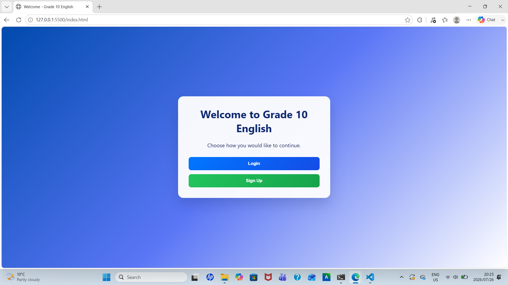
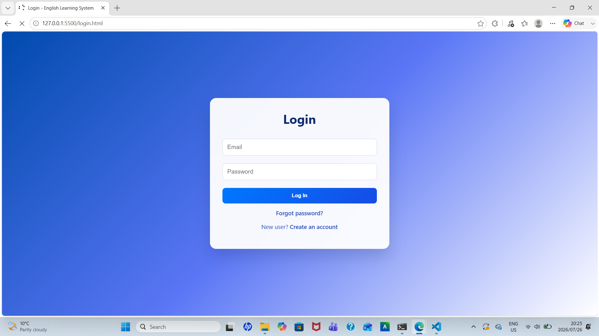
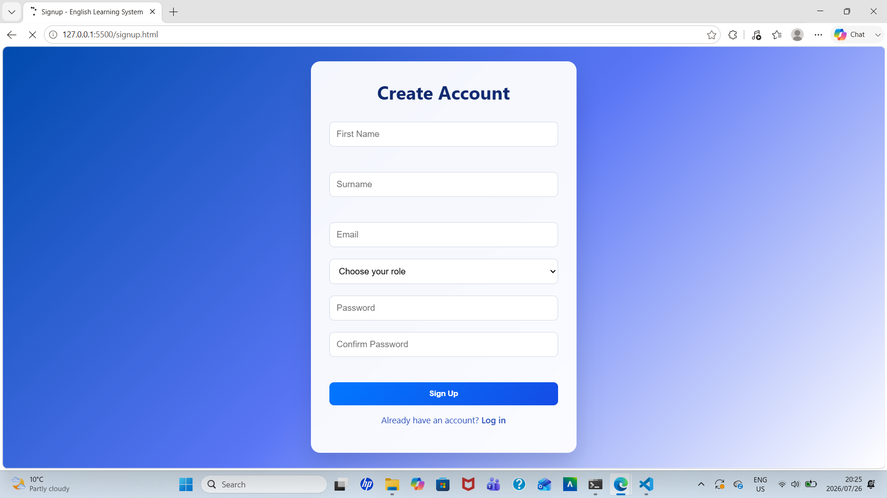
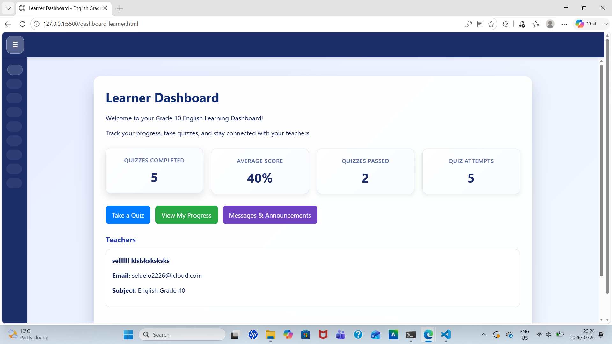
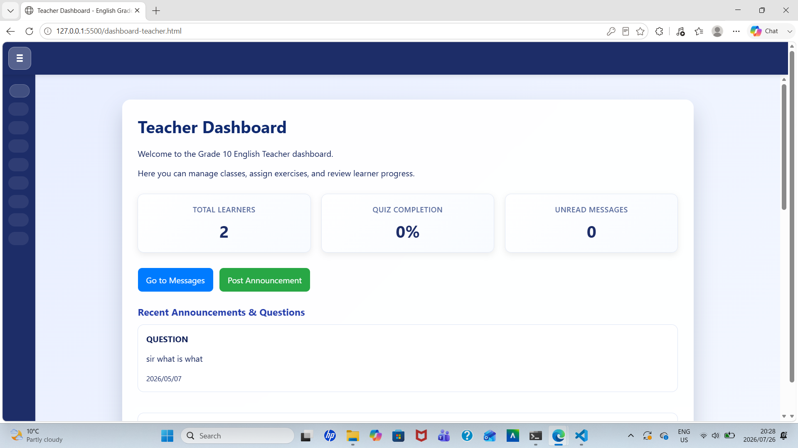
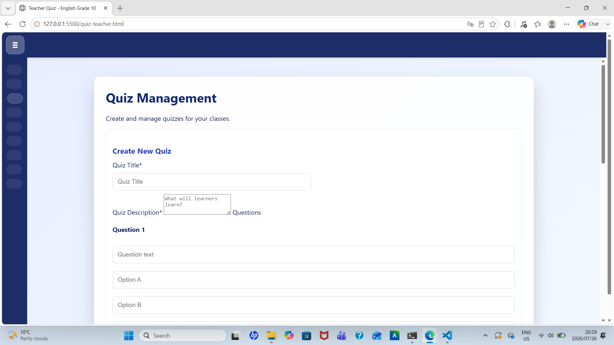
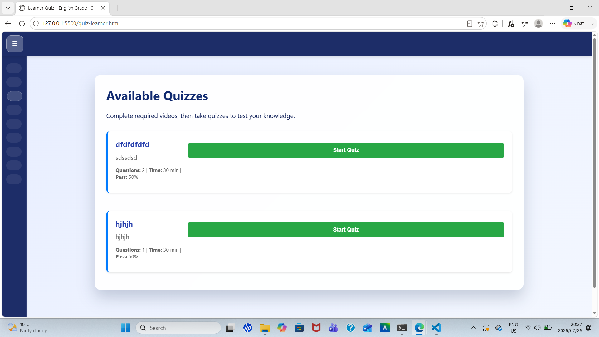
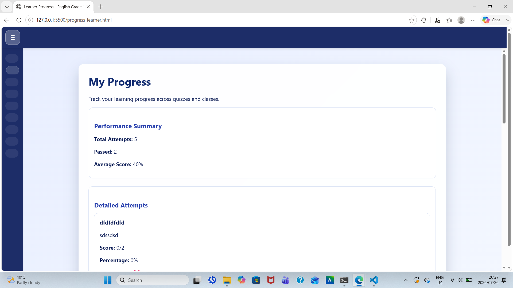
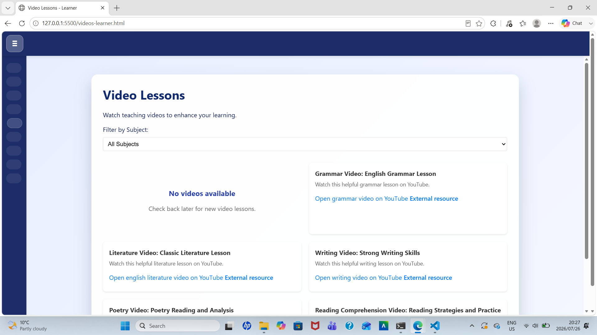
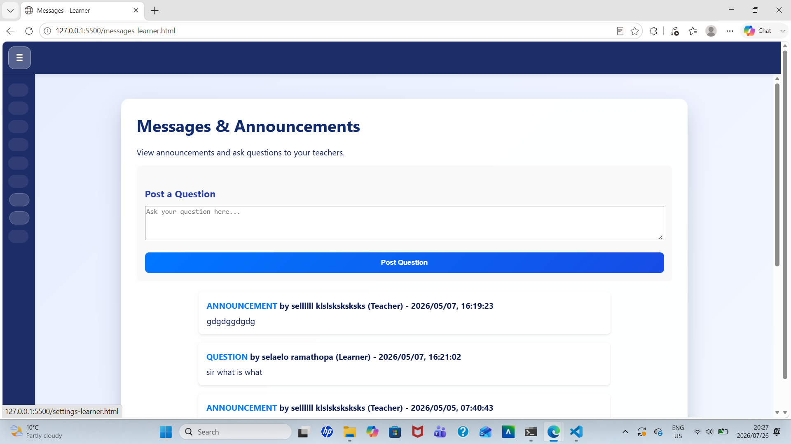

# Grade 10 English Teacher

## Overview

The **Grade 10 English Teacher** is a web-based e-learning platform developed to support Grade 10 English teaching and learning. The platform enables teachers to upload educational content and quizzes while allowing learners to access lessons, watch embedded YouTube educational videos, complete quizzes, and monitor their learning progress.

The application was developed using **HTML**, **CSS**, **JavaScript**, and **Supabase** for authentication and database management.

## Features

### Teacher

- Secure login
- Upload quizzes
- Manage learning content
- View learner information
- Monitor learner performance

### Learner

- Register an account
- Secure login
- Watch embedded YouTube English lessons
- Complete teacher-created quizzes
- View quiz scores
- Track learning progress

## Technologies Used

- HTML5
- CSS3
- JavaScript (ES6)
- Supabase
- GitHub Pages
- Embedded YouTube Videos

## Application Screenshots

### Home Page

### Login Page

### Registration Page

### Learner Dashboard

### Teacher Dashboard

### Quiz management

### Quiz Page

### Quiz scores

### Lessons

### Announcement

### Announcement page

## Database

Supabase is used for:

- User Authentication
- User Profiles
- Quiz Storage
- Learner Progress
- Database Management

## Learning Features

- Interactive English learning
- Video-based lessons
- Online quizzes
- Progress tracking
- Teacher-managed content
- Easy-to-use interface

---

## Live Demo

Visit the live website:

**https://selaeloramathopa.github.io/Grade-10-english-teacher/**

## Future Improvements

Planned enhancements include:

- AI-powered English tutoring
- Pronunciation assessment
- Speech recognition
- Discussion forums
- Leaderboards
- Achievement badges
- Teacher analytics dashboard
- Mobile application

## Author

**Selaelo Ramathopa**

## 📄 License

This project is licensed under the MIT License.
